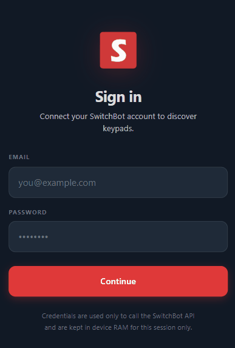
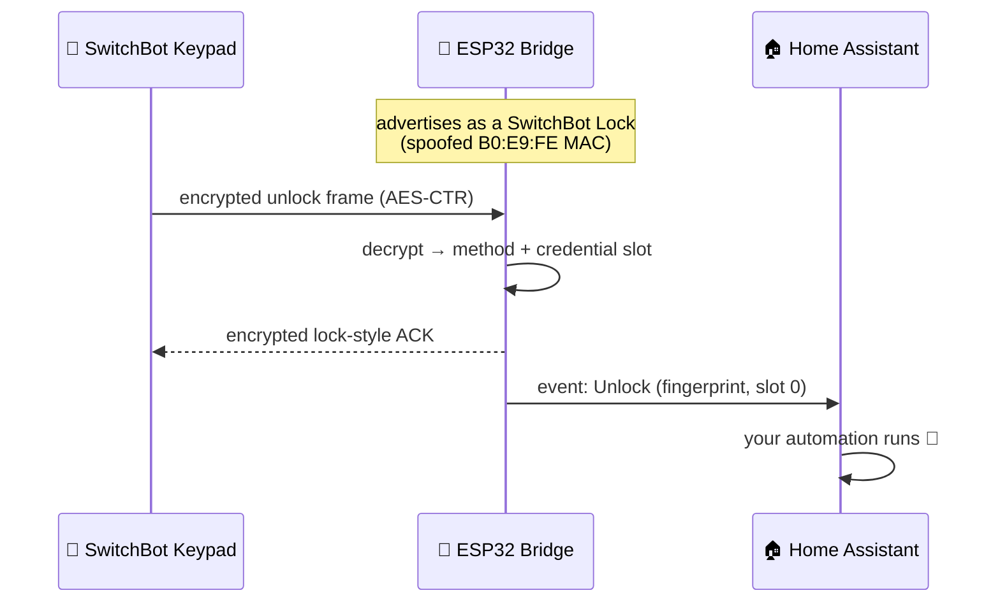

<div align="center">

# 🔐 SwitchBot Keypad Bridge

**Use a SwitchBot Keypad without a SwitchBot Lock.**

An ESP32 that impersonates a SwitchBot Lock over Bluetooth LE — a genuine keypad
pairs to it, and every PIN, fingerprint, NFC tag and face unlock becomes a
Home Assistant event. The keypad never knows it isn't talking to a real lock.

[](https://esphome.io/)
[](https://www.espressif.com/)
[](https://www.home-assistant.io/)
[](https://buymeacoffee.com/pierluigizagaria)



*The on-device pairing wizard — no Python scripts, no BLE sniffing, no laptop.*

</div>

---

## ✨ Highlights

- 🔓 **No SwitchBot Lock required** — repurpose a keypad as a standalone, fully
  local door/access controller.
- 📟 **Every SwitchBot keypad works** — Keypad, Keypad Touch, Keypad Vision and
  Vision Pro: that's the whole lineup. Touch and Vision are tested on real
  hardware; the other two speak the exact same protocols.
- 🌐 **On-device web console** — Pair, Activity (event log), Users and Settings
  tabs, in English or Hebrew (RTL), optionally behind a login.
- 👤 **Knows who unlocked** — every unlock carries the method (`pin` /
  `fingerprint` / `nfc` / `face`), the credential slot **and a name** you can
  map in the browser (no reflash).
- 🚨 **Keypad alarms** (Vision) — **tamper** (pried off the wall), **duress**
  (panic code), **lockout** (too many wrong tries), **motion** and **charging**,
  as Home Assistant binary sensors + `on_tamper` / `on_duress` triggers.
- 🔔 **Doorbell, no lock needed** — on Keypad Vision the doorbell button is
  enabled automatically during pairing (the app normally hides it until a lock
  is bound) and each press fires its own Home Assistant event.
- 🔋 **Battery, signal & liveness** — battery %, RSSI, a "last seen" timestamp
  and a connected sensor, all read from the keypad's BLE advertisement.
- 🔌 **Wi-Fi *or* wired Ethernet** — a ready-made WT32-ETH01 (LAN8720) config
  ships alongside the Wi-Fi one.
- 🔐 **Keys never leave the device** — the AES-128 session key is generated on
  the ESP32 and stored in NVS; it is never in your YAML or git.
- 🏠 **100% local after pairing** — the cloud is contacted exactly once, during
  pairing. Day-to-day operation is pure BLE + ESPHome, no cloud round-trips.

## 🧠 How it works

A SwitchBot Keypad is not a dumb button matrix: it encrypts every command with
AES-CTR and only talks to a device that advertises like a SwitchBot Lock,
answers the lock GATT protocol, **and** carries a `B0:E9:FE` SwitchBot MAC.
The bridge plays that part end to end:



**Pairing** is the only step that touches the cloud, because the keypad ships
encrypted with a *communication key* that lives on SwitchBot's servers, not in
the app. The on-device wizard signs in to your account, fetches that key over
HTTPS, uses it to re-encrypt the pairing handshake, and injects a fresh AES-128
session key generated on the ESP32. From that moment the keypad and the bridge
share a secret no one else has — including SwitchBot.

Curious about the details — MAC spoofing, NimBLE, key rotation? See
[Under the hood](#-under-the-hood).

## 🚀 Quick start

**You need:** an ESP32 and a SwitchBot Keypad already added to your SwitchBot
account.

### 1. Create `secrets.yaml`

Copy `secrets.example.yaml` to `secrets.yaml` and fill in your details:

```yaml
wifi_ssid: "your_network_name"
wifi_password: "your_wifi_password"
ota_password: "a_strong_ota_password"
```

### 2. Flash the ESP32

```bash
pip install esphome
esphome run switchbot-keypad-bridge.yaml
```

### 3. Pair the keypad

On first boot — with no keypad paired — the device opens its **pairing wizard**
automatically. Open it in a browser at `http://<device-ip>/` (the IP is in the
boot log, or use Home Assistant's **Visit Device** link on the device page):

1. Sign in with your SwitchBot account.
2. Pick your keypad from the list.
3. Wait for the wizard to finish — it closes itself when done.

> The wizard recognises the keypad from its live BLE advertisement, so keep it
> powered and within ~2 m of the ESP32 — out-of-range devices won't be listed.

That's it. The keypad's name appears on the **Keypad** sensor and key presses
arrive in Home Assistant as `Lock` / `Unlock` / `Doorbell` events.

> **Re-pairing** — to switch to a different keypad, press the **Unpair** button
> in Home Assistant. The device forgets the current keypad, rotates its session
> key, and re-opens the pairing wizard right away — no reboot.

To stream logs at any time:

```bash
esphome logs switchbot-keypad-bridge.yaml
```

## 🔌 Wired Ethernet — WT32-ETH01 (ESP-LAN)

Prefer a wired connection at the door? The bridge runs unchanged over
Ethernet — the firmware is completely network-agnostic, so only the YAML
differs. A ready-made config for the **WT32-ETH01** (ESP32-WROOM-32 + LAN8720
PHY) ships as [`switchbot-keypad-bridge-wt32-eth01.yaml`](switchbot-keypad-bridge-wt32-eth01.yaml):

```bash
esphome run switchbot-keypad-bridge-wt32-eth01.yaml
```

The Ethernet build needs no Wi-Fi credentials — only `ota_password` in
`secrets.yaml`. Everything else (pairing wizard on port 80, unlock events,
battery, doorbell) works exactly as on the Wi-Fi build.

> **Why wired can be better here:** on the ESP32, BLE and wired Ethernet don't
> share the radio the way Wi-Fi + BLE do, so the BLE link to the keypad never
> competes with network traffic.

The config already carries the correct LAN8720 pin-out for the WT32-ETH01
(`MDC=GPIO23`, `MDIO=GPIO18`, clock in on `GPIO0`, `power_pin=GPIO16`,
`phy_addr=1`). Any ESP32 with a supported Ethernet PHY works — just adapt the
`ethernet:` block (e.g. an Olimex ESP32-PoE for a Power-over-Ethernet door
controller).

> **No PSRAM on the WT32-ETH01.** The bridge runs fine without it; ESPHome
> will print a one-line "consider enabling PSRAM" note at compile time, which
> is safe to ignore on this board.

## 🖥️ The web console

The ESP32 serves a small web console at `http://<device-ip>/` — the same page
that hosts the pairing wizard stays up afterwards as a config console, with
four tabs:

- **Pair** — the pairing wizard (sign in, pick a keypad). Also used to re-pair.
- **Activity** — the last lock / unlock / doorbell events the bridge saw, with
  the method, credential slot and resolved user name, and a relative timestamp.
- **Users** — map each credential `(method, slot)` to a person's name. Saved on
  the device (NVS), applied live — **no recompile**. This is what fills the
  `name` on unlocks (see below).
- **Settings** — battery scan interval, the unlock debounce, and a **Keypad
  scanning** toggle you can switch off to save power.

It's bilingual (**English / עברית**, RTL-aware) via the toggle in the top bar.

> **Protect it with a login.** The console is open on your LAN by default. Set a
> password to require HTTP Basic Auth on every page and endpoint:
> ```yaml
> switchbot_keypad_bridge:
>   web_username: "admin"          # optional, defaults to "admin"
>   web_password: !secret web_password
> ```

## 👤 Knowing who unlocked the door

Every `on_unlock` trigger carries three values:

| Parameter | Type | Values |
|---|---|---|
| `method` | `std::string` | `"pin"`, `"fingerprint"`, `"nfc"`, `"face"`, or `"unknown"` |
| `index` | `int` | Numeric ID of the credential slot |
| `name` | `std::string` | The person's name for that credential — resolved from `users:` (YAML) or the **Users** tab in the web console. Empty if the slot isn't mapped yet. |

`index` is the slot the SwitchBot app assigns when you add a credential — first
one gets `0`, the next `1`, and so on. Map each `(method, index)` to a name and
the bridge fills in `name` for you — no need to build the lookup in Home
Assistant. You can do it in YAML, or live in the browser (**Users** tab, saved
on the device — no recompile).

Forward all three to Home Assistant as a custom event:

```yaml
switchbot_keypad_bridge:
  # Name each credential (or do this live in the web UI's Users tab).
  # method defaults to "any", index to -1 (any slot); most-specific match wins.
  users:
    - { name: "Liran", method: fingerprint, index: 0 }
    - { name: "Liran", method: face,        index: 0 }
    - { name: "Dana",  method: pin,         index: 1 }
  on_unlock:
    - homeassistant.event:
        event: esphome.switchbot_keypad_unlock
        data:
          method: !lambda 'return method;'
          index:  !lambda 'return to_string(index);'
          name:   !lambda 'return name;'
```

### 📣 On every unlock — announce who opened, and how

One automation covers everyone: it reads `name` and `method` straight off the
event, so you never touch it again when you add a person.

```yaml
alias: Announce who unlocked
triggers:
  - trigger: event
    event_type: esphome.switchbot_keypad_unlock
actions:
  - variables:
      who: "{{ trigger.event.data.name or ('slot ' ~ trigger.event.data.index) }}"
      how: >-
        {{ {'pin': 'a PIN', 'fingerprint': 'a fingerprint',
            'face': 'face recognition', 'nfc': 'an NFC tag'}
           .get(trigger.event.data.method, trigger.event.data.method) }}
  - action: notify.mobile_app_phone      # ← your notify service
    data:
      title: "🔓 Door unlocked"
      message: "{{ who }} unlocked the door using {{ how }}."
```

Result: *“Liran unlocked the door using a fingerprint.”* If a slot has no name
yet it falls back to *“slot 0 unlocked the door using face recognition”* — open
the **Activity** tab (or the logs) to read the method + slot number, then name
it in **Users**.

### One automation per person (optional)

Prefer a distinct action per person? Match on `name`:

```yaml
alias: Welcome home — Liran
triggers:
  - trigger: event
    event_type: esphome.switchbot_keypad_unlock
conditions:
  - "{{ trigger.event.data.name == 'Liran' }}"
actions:
  - action: notify.mobile_app
    data:
      message: Welcome home, Liran!
```

## 🤖 Automating from the Action event entity

With the `keypad_action` (the **Action** `event` entity) configured, Home
Assistant exposes it as `event.switchbot_keypad_bridge_action`. Its state is the
timestamp of the last action and its `event_type` attribute is `Lock`, `Unlock`
or `Doorbell` — so you can automate straight off it, no custom event required.

> The entity id follows your device name: `event.<node_name>_action`. For the
> default `name: switchbot-keypad-bridge` that's
> `event.switchbot_keypad_bridge_action`.

**Do something on every unlock:**

```yaml
alias: Notify on unlock
triggers:
  - trigger: state
    entity_id: event.switchbot_keypad_bridge_action
conditions:
  - "{{ trigger.to_state.attributes.event_type == 'Unlock' }}"
actions:
  - action: notify.mobile_app_phone
    data:
      message: "Door unlocked at {{ now().strftime('%H:%M') }}"
```

**Flash a light on the doorbell:**

```yaml
alias: Doorbell → blink the living-room light
triggers:
  - trigger: state
    entity_id: event.switchbot_keypad_bridge_action
conditions:
  - "{{ trigger.to_state.attributes.event_type == 'Doorbell' }}"
actions:
  - action: light.turn_on
    target:
      entity_id: light.living_room
    data:
      flash: short
```

Trigger on the entity's **state change** (a fresh timestamp fires on every
action) and filter by the `event_type` attribute in the condition. That way two
identical actions in a row — e.g. Unlock, then Unlock again — both fire, which a
`to: "Unlock"` attribute trigger would miss because the attribute value didn't
change.

> Want to know *who* unlocked (method + user name)? Use the `on_unlock`
> custom-event pattern above, or read the **Last User** text sensor.

## 🔔 Doorbell (Keypad Vision)

The official app hides the doorbell button until a SwitchBot Lock is bound to
your account, so the bridge enables it automatically at the end of pairing.
Each press fires the `on_doorbell` trigger and a `Doorbell` event:

```yaml
switchbot_keypad_bridge:
  on_doorbell:
    - homeassistant.event:
        event: esphome.switchbot_keypad_doorbell
```

> Vision family only — Original / Touch keypads have no doorbell button.

## 🔋 Battery, signal & liveness

The keypad broadcasts its state in its BLE advertisement; the bridge reads it
with a short background scan and exposes:

```yaml
switchbot_keypad_bridge:
  battery_level:    { name: "Keypad Battery" }     # %
  rssi:             { name: "Keypad Signal" }      # dBm
  keypad_connected: { name: "Keypad Connected" }   # on during each BLE action
  last_seen:        { name: "Keypad Last Seen", device_class: timestamp }

  battery_scan_interval: 15min   # min 30s — also settable in the Settings tab
```

`last_seen` also updates on every connection, so an automation can alert you if
the keypad drops off the air (removed, out of range, or a flat battery):

```yaml
alias: Alert — keypad not seen for a while
triggers:
  - trigger: state
    entity_id: sensor.switchbot_keypad_bridge_keypad_last_seen
    for: "00:45:00"          # set well above battery_scan_interval
actions:
  - action: notify.mobile_app_phone
    data:
      message: "⚠️ The keypad hasn't been seen for 45 minutes — check it."
```

## 🚨 Keypad alarms (Vision)

The Keypad Vision / Vision Pro broadcast alarm and status flags in their
advertisement. Wire any of them as binary sensors — and **wiring an alarm makes
the advert scan run at `alarm_scan_interval`** (default `30s`) instead of the
slow battery interval, so alarms surface promptly:

```yaml
switchbot_keypad_bridge:
  alarm_scan_interval: 30s   # min 5s; lower = faster alarms, more radio use
  tamper:   { name: "Keypad Tamper" }    # pried off its mount
  duress:   { name: "Keypad Duress" }    # a duress / panic code was entered
  lockout:  { name: "Keypad Lockout" }   # locked out after too many wrong tries
  motion:   { name: "Keypad Motion" }    # PIR (Vision) / radar (Vision Pro)
  charging: { name: "Keypad Charging" }

  on_tamper:
    - homeassistant.event: { event: esphome.switchbot_keypad_tamper }
  on_duress:
    - homeassistant.event: { event: esphome.switchbot_keypad_duress }
```

Example — sound the siren the moment the keypad is tampered with:

```yaml
alias: Tamper → siren + notify
triggers:
  - trigger: event
    event_type: esphome.switchbot_keypad_tamper
actions:
  - action: switch.turn_on
    target: { entity_id: switch.siren }
  - action: notify.mobile_app_phone
    data:
      message: "🚨 Keypad tamper alarm!"
```

> **Vision family only.** Original / Touch keypads don't carry these flags — for
> them only `battery_level` is available.
>
> **Power.** The scan is *not* continuous — it runs a brief window every
> `alarm_scan_interval` and stops as soon as it reads an advert, so the radio
> isn't pinned on. `battery_level` keeps its own slow `battery_scan_interval`.
> You can also switch scanning off entirely in the **Settings** tab.
>
> **`motion` is best-effort.** The keypad's PIR/radar field is an undocumented
> 0–3 level, not a clean flag; the bridge treats level ≥ 2 as motion and logs
> the raw value (`pir=…`) at DEBUG. If it misreads on your unit, capture the
> `Keypad status: … pir=N` log lines idle vs. moving and tune the threshold.

## 📖 More automation recipes

A full cookbook — per-user actions, time-window access, duress/tamper/lockout
handling, motion, doorbell snapshots, offline & low-battery alerts — lives in
**[docs/automations.md](docs/automations.md)**.

## ⚙️ Configuration reference

All options are optional.

| Option | Type | Description |
|---|---|---|
| `keypad_action` | event | ESPHome `event` entity for keypad actions. Surfaces in HA as `event.<device>_action` with `Lock` / `Unlock` / `Doorbell` types. |
| `keypad` | text_sensor | Display name of the paired keypad (`Unpaired` if none). |
| **Who unlocked** | | |
| `last_user` | text_sensor | Resolved name of the last unlock (falls back to `<method> #<index>`). |
| `last_method` | text_sensor | Method of the last unlock (`pin` / `fingerprint` / `nfc` / `face`). |
| `unlock_counts` | map | Per-method running counters: `pin` / `nfc` / `fingerprint` / `face` sensors (reset on reboot). |
| `users` | list | Map credentials to names: `- { name, method, index }`. `method` defaults to `any`, `index` to `-1`; most-specific match wins. Also editable in the Users tab. |
| `min_unlock_interval` | time | Debounce repeated unlocks from the same credential. `0s` = off. Also in Settings. |
| **Battery / signal / liveness** | | |
| `battery_level` | sensor | Keypad battery %. |
| `rssi` | sensor | Keypad BLE signal strength (dBm). |
| `keypad_connected` | binary_sensor | On during the keypad's brief per-action BLE connection. |
| `last_seen` | text_sensor | ISO-8601 UTC timestamp of the last contact (add `device_class: timestamp`). |
| `battery_scan_interval` | time | How often to scan the advertisement (min `30s`, default `15min`). Also in Settings. |
| **Alarms (Keypad Vision)** | | |
| `tamper` / `duress` / `lockout` / `motion` / `charging` | binary_sensor | Alarm & status flags from the Vision advert. Wiring any alarm switches the scan to `alarm_scan_interval`. `motion` is best-effort (see above). |
| `alarm_scan_interval` | time | Advert-scan cadence while alarms are wired (default `30s`, min `5s`) — separate from `battery_scan_interval`. |
| **Web console** | | |
| `web_username` | string | HTTP Basic Auth username (default `admin`). |
| `web_password` | string | HTTP Basic Auth password. Omit to leave the console open on the LAN. |
| **Misc** | | |
| `unpair_button` | button | Forgets the keypad, rotates the session key, re-opens the wizard (no reboot). |
| **Triggers** | | |
| `on_lock` | automation | On every `lock` command. |
| `on_unlock` | automation | On every unlock — params `(std::string method, int index, std::string name)`. |
| `on_doorbell` | automation | On every doorbell press (Vision). |
| `on_tamper` | automation | On the tamper alarm (Vision). |
| `on_duress` | automation | On the duress/panic code (Vision). |

## 🔬 Under the hood

- **Model detection over BLE** — the wizard identifies the keypad model from
  its live advertisement (pySwitchbot-style) and adapts the pairing protocol
  accordingly, so even a future model pairs fine as long as it speaks one of
  the two protocol families (*Original* or *Vision*).
- **MAC spoofing** — at boot the bridge rewrites its BLE address into
  SwitchBot's OUI (`B0:E9:FE:xx:xx:xx`), preserving the chip-unique last three
  bytes. The Keypad Vision filters scan results on this prefix and would
  otherwise ignore the bridge.
- **NimBLE, not the ESPHome BLE stack** — the component drives NimBLE directly
  (via the `esp-nimble-cpp` managed component) and uses the mbed-TLS PSA Crypto
  API that already ships with ESP-IDF. No extra Python or C++ dependencies —
  but it cannot coexist with ESPHome's own BLE stack (`esp32_ble`,
  `esp32_ble_tracker`, `esp32_improv`, …).
- **Advertisement parsing** — battery, RSSI, and the Vision alarm/status flags
  (tamper, duress, lockout, motion, charging) are decoded straight from the
  keypad's BLE advertisement — a clean-room port of pySwitchbot's `keypad_vision`
  parser — so they need no cloud and no connection.
- **Always-on console** — the pairing web server stays up as a config console
  (Pair / Activity / Users / Settings), guarded by HTTP Basic Auth when a
  `web_password` is set. It reuses ESPHome's `USE_WEBSERVER` flag so Home
  Assistant shows a **Visit Device** link.
- **Key hygiene** — unpairing rotates the session key, so a previously paired
  keypad can no longer command the bridge.

## ❓ FAQ

<details>
<summary><b>Why do I have to sign in with my SwitchBot account?</b></summary>

The keypad encrypts its pairing handshake with a *communication key* that is
issued and stored by SwitchBot's servers — it is not in the app and cannot be
read from the keypad itself. The wizard signs in from the ESP32, fetches that
key over HTTPS, and uses it once to complete the handshake. After pairing the
keypad talks to the bridge with a locally generated session key and the cloud
is never contacted again.
</details>

<details>
<summary><b>Is anything cloud-dependent after pairing?</b></summary>

No. Unlock events, the doorbell, battery readings — everything runs over local
BLE between the keypad and the ESP32, and over the native API between the
ESP32 and Home Assistant.
</details>

<details>
<summary><b>Home Assistant shows a different MAC than the boot log — which is right?</b></summary>

Both. Home Assistant shows the Wi-Fi MAC; the boot log
(`Ready. Advertising on …`) shows the BLE address, which the bridge spoofs
into SwitchBot's `B0:E9:FE` OUI so the keypad will accept it.
</details>

<details>
<summary><b>My keypad doesn't show up in the wizard.</b></summary>

The wizard only lists devices it can *see* over BLE. Make sure the keypad is
powered, within ~2 m of the ESP32, and added to the SwitchBot account you
signed in with.
</details>

<details>
<summary><b>ESPHome refuses to compile with <code>esp32_ble</code> / <code>esp32_ble_tracker</code> in my config.</b></summary>

That's intentional. The bridge drives NimBLE directly and cannot share the
radio with ESPHome's BLE stack, so config validation fails fast instead of
producing a firmware that breaks at runtime. Remove the conflicting components
(including `esp32_improv`).
</details>
