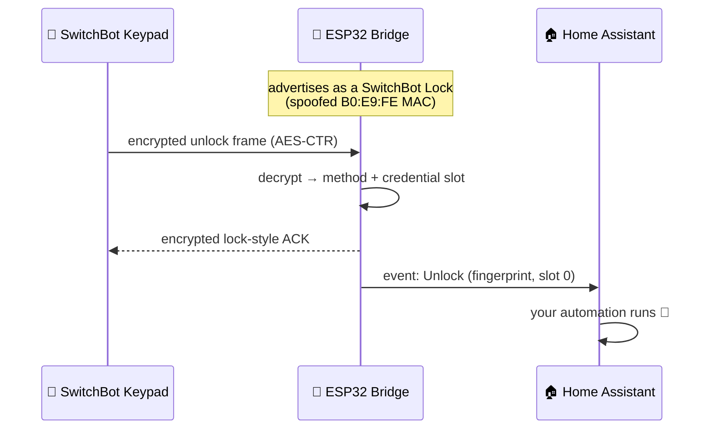

<div align="center">

# 🔐 SwitchBot Keypad Bridge

**Use a SwitchBot Keypad without a SwitchBot Lock.**

An ESP32 that impersonates a SwitchBot Lock over Bluetooth LE — a genuine keypad
pairs to it, and every PIN, fingerprint, NFC tag and face unlock becomes a
Home Assistant event. The keypad never knows it isn't talking to a real lock.

[](https://esphome.io/)
[](https://www.espressif.com/)
[](https://www.home-assistant.io/)
[](https://buymeacoffee.com/pierluigizagaria)


*The on-device pairing wizard — no Python scripts, no BLE sniffing, no laptop.*

</div>

---

## ✨ Highlights

- 🔓 **No SwitchBot Lock required** — repurpose a keypad as a standalone, fully
  local door/access controller.
- 📟 **Every SwitchBot keypad works** — Keypad, Keypad Touch, Keypad Vision and
  Vision Pro: that's the whole lineup. Touch and Vision are tested on real
  hardware; the other two speak the exact same protocols.
- 📲 **On-device pairing wizard** — the ESP32 serves a small web page: sign in
  to your SwitchBot account, pick the keypad, done.
- 👤 **Knows who unlocked** — every unlock carries the method (`pin` /
  `fingerprint` / `nfc` / `face`) and the credential slot, so you can act per user.
- 🔔 **Doorbell, no lock needed** — on Keypad Vision the doorbell button is
  enabled automatically during pairing (the app normally hides it until a lock
  is bound) and each press fires its own Home Assistant event.
- 🔋 **Battery monitoring** — the keypad's battery level, exposed as a
  diagnostic sensor.
- 🔐 **Keys never leave the device** — the AES-128 session key is generated on
  the ESP32 and stored in NVS; it is never in your YAML or git.
- 🏠 **100% local after pairing** — the cloud is contacted exactly once, during
  pairing. Day-to-day operation is pure BLE + ESPHome, no cloud round-trips.

## 🧠 How it works

A SwitchBot Keypad is not a dumb button matrix: it encrypts every command with
AES-CTR and only talks to a device that advertises like a SwitchBot Lock,
answers the lock GATT protocol, **and** carries a `B0:E9:FE` SwitchBot MAC.
The bridge plays that part end to end:



**Pairing** is the only step that touches the cloud, because the keypad ships
encrypted with a *communication key* that lives on SwitchBot's servers, not in
the app. The on-device wizard signs in to your account, fetches that key over
HTTPS, uses it to re-encrypt the pairing handshake, and injects a fresh AES-128
session key generated on the ESP32. From that moment the keypad and the bridge
share a secret no one else has — including SwitchBot.

Curious about the details — MAC spoofing, NimBLE, key rotation? See
[Under the hood](#-under-the-hood).

## 🚀 Quick start

**You need:** an ESP32 and a SwitchBot Keypad already added to your SwitchBot
account.

### 1. Create `secrets.yaml`

Copy `secrets.example.yaml` to `secrets.yaml` and fill in your details:

```yaml
wifi_ssid: "your_network_name"
wifi_password: "your_wifi_password"
ota_password: "a_strong_ota_password"
```

### 2. Flash the ESP32

```bash
pip install esphome
esphome run switchbot-keypad-bridge.yaml
```

### 3. Pair the keypad

On first boot — with no keypad paired — the device opens its **pairing wizard**
automatically. Open it in a browser at `http://<device-ip>/` (the IP is in the
boot log, or use Home Assistant's **Visit Device** link on the device page):

1. Sign in with your SwitchBot account.
2. Pick your keypad from the list.
3. Wait for the wizard to finish — it closes itself when done.

> The wizard recognises the keypad from its live BLE advertisement, so keep it
> powered and within ~2 m of the ESP32 — out-of-range devices won't be listed.

That's it. The keypad's name appears on the **Keypad** sensor and key presses
arrive in Home Assistant as `Lock` / `Unlock` / `Doorbell` events.

> **Re-pairing** — to switch to a different keypad, press the **Unpair** button
> in Home Assistant. The device forgets the current keypad, rotates its session
> key, and re-opens the pairing wizard right away — no reboot.

To stream logs at any time:

```bash
esphome logs switchbot-keypad-bridge.yaml
```

## 🔌 Wired Ethernet — WT32-ETH01 (ESP-LAN)

Prefer a wired connection at the door? The bridge runs unchanged over
Ethernet — the firmware is completely network-agnostic, so only the YAML
differs. A ready-made config for the **WT32-ETH01** (ESP32-WROOM-32 + LAN8720
PHY) ships as [`switchbot-keypad-bridge-wt32-eth01.yaml`](switchbot-keypad-bridge-wt32-eth01.yaml):

```bash
esphome run switchbot-keypad-bridge-wt32-eth01.yaml
```

The Ethernet build needs no Wi-Fi credentials — only `ota_password` in
`secrets.yaml`. Everything else (pairing wizard on port 80, unlock events,
battery, doorbell) works exactly as on the Wi-Fi build.

> **Why wired can be better here:** on the ESP32, BLE and wired Ethernet don't
> share the radio the way Wi-Fi + BLE do, so the BLE link to the keypad never
> competes with network traffic.

The config already carries the correct LAN8720 pin-out for the WT32-ETH01
(`MDC=GPIO23`, `MDIO=GPIO18`, clock in on `GPIO0`, `power_pin=GPIO16`,
`phy_addr=1`). Any ESP32 with a supported Ethernet PHY works — just adapt the
`ethernet:` block (e.g. an Olimex ESP32-PoE for a Power-over-Ethernet door
controller).

> **No PSRAM on the WT32-ETH01.** The bridge runs fine without it; ESPHome
> will print a one-line "consider enabling PSRAM" note at compile time, which
> is safe to ignore on this board.

## 👤 Knowing who unlocked the door

Every `on_unlock` trigger carries two values:

| Parameter | Type | Values |
|---|---|---|
| `method` | `std::string` | `"pin"`, `"fingerprint"`, `"nfc"`, `"face"`, or `"unknown"` |
| `index` | `int` | Numeric ID of the credential slot |

`index` is the slot the SwitchBot app assigns when you add a credential — first
one gets `0`, the next `1`, and so on. Combined with `method`, it tells you
exactly who is at the door.

The cleanest pattern: forward both values to Home Assistant as a custom event
and build per-user automations there, without recompiling the firmware:

```yaml
switchbot_keypad_bridge:
  on_unlock:
    - homeassistant.event:
        event: esphome.switchbot_keypad_unlock
        data:
          method: !lambda 'return method;'
          index: !lambda 'return to_string(index);'
```

Then in Home Assistant, one automation per credential:

```yaml
alias: Welcome home — owner fingerprint
triggers:
  - trigger: event
    event_type: esphome.switchbot_keypad_unlock
conditions:
  - condition: template
    value_template: >
      {{ trigger.event.data.method == 'fingerprint' and
         trigger.event.data.index == '0' }}
actions:
  - action: notify.mobile_app
    data:
      message: Welcome home!
```

## 🤖 Automating from the Action event entity

With the `keypad_action` (the **Action** `event` entity) configured, Home
Assistant exposes it as `event.switchbot_keypad_bridge_action`. Its state is the
timestamp of the last action and its `event_type` attribute is `Lock`, `Unlock`
or `Doorbell` — so you can automate straight off it, no custom event required.

> The entity id follows your device name: `event.<node_name>_action`. For the
> default `name: switchbot-keypad-bridge` that's
> `event.switchbot_keypad_bridge_action`.

**Do something on every unlock:**

```yaml
alias: Notify on unlock
triggers:
  - trigger: state
    entity_id: event.switchbot_keypad_bridge_action
conditions:
  - "{{ trigger.to_state.attributes.event_type == 'Unlock' }}"
actions:
  - action: notify.mobile_app_phone
    data:
      message: "Door unlocked at {{ now().strftime('%H:%M') }}"
```

**Flash a light on the doorbell:**

```yaml
alias: Doorbell → blink the living-room light
triggers:
  - trigger: state
    entity_id: event.switchbot_keypad_bridge_action
conditions:
  - "{{ trigger.to_state.attributes.event_type == 'Doorbell' }}"
actions:
  - action: light.turn_on
    target:
      entity_id: light.living_room
    data:
      flash: short
```

Trigger on the entity's **state change** (a fresh timestamp fires on every
action) and filter by the `event_type` attribute in the condition. That way two
identical actions in a row — e.g. Unlock, then Unlock again — both fire, which a
`to: "Unlock"` attribute trigger would miss because the attribute value didn't
change.

> Want to know *who* unlocked (method + user name)? Use the `on_unlock`
> custom-event pattern above, or read the **Last User** text sensor.

## 🔔 Doorbell (Keypad Vision)

The official app hides the doorbell button until a SwitchBot Lock is bound to
your account, so the bridge enables it automatically at the end of pairing.
Each press fires the `on_doorbell` trigger and a `Doorbell` event:

```yaml
switchbot_keypad_bridge:
  on_doorbell:
    - homeassistant.event:
        event: esphome.switchbot_keypad_doorbell
```

> Vision family only — Original / Touch keypads have no doorbell button.

## 🔋 Keypad battery

The keypad broadcasts its battery level in its BLE advertisement. Add the
`battery_level` sensor and the bridge picks it up with a short background scan
(every 15 minutes by default):

```yaml
switchbot_keypad_bridge:
  battery_level:
    name: "Keypad Battery"
  battery_scan_interval: 15min
```

## ⚙️ Configuration reference

| Option | Type | Required | Description |
|---|---|---|---|
| `keypad_action` | event | no | Standard ESPHome `event` entity for keypad actions. Surfaces in HA as `event.<device>_action` with `Lock` / `Unlock` / `Doorbell` event types. |
| `keypad` | text_sensor | no | Text sensor whose state is the display name of the paired keypad (Configuration category; empty if none). |
| `battery_level` | sensor | no | Battery percentage of the paired keypad, read from its BLE advertisement (Diagnostic category). |
| `battery_scan_interval` | time | no | How often the bridge scans for the keypad's advertisement to refresh `battery_level`. Default `15min`. |
| `unpair_button` | button | no | Button that forgets the paired keypad, rotates the session key and re-opens the pairing wizard (no reboot). |
| `on_lock` | automation | no | Triggered on every `lock` command. |
| `on_unlock` | automation | no | Triggered on every `unlock` command — parameters `(std::string method, int index)`. |
| `on_doorbell` | automation | no | Triggered on every doorbell press (Keypad Vision). No parameters. |

## 🔬 Under the hood

- **Model detection over BLE** — the wizard identifies the keypad model from
  its live advertisement (pySwitchbot-style) and adapts the pairing protocol
  accordingly, so even a future model pairs fine as long as it speaks one of
  the two protocol families (*Original* or *Vision*).
- **MAC spoofing** — at boot the bridge rewrites its BLE address into
  SwitchBot's OUI (`B0:E9:FE:xx:xx:xx`), preserving the chip-unique last three
  bytes. The Keypad Vision filters scan results on this prefix and would
  otherwise ignore the bridge.
- **NimBLE, not the ESPHome BLE stack** — the component drives NimBLE directly
  (via the `esp-nimble-cpp` managed component) and uses the mbed-TLS PSA Crypto
  API that already ships with ESP-IDF. No extra Python or C++ dependencies —
  but it cannot coexist with ESPHome's own BLE stack (`esp32_ble`,
  `esp32_ble_tracker`, `esp32_improv`, …).
- **Key hygiene** — unpairing rotates the session key, so a previously paired
  keypad can no longer command the bridge.

## ❓ FAQ

<details>
<summary><b>Why do I have to sign in with my SwitchBot account?</b></summary>

The keypad encrypts its pairing handshake with a *communication key* that is
issued and stored by SwitchBot's servers — it is not in the app and cannot be
read from the keypad itself. The wizard signs in from the ESP32, fetches that
key over HTTPS, and uses it once to complete the handshake. After pairing the
keypad talks to the bridge with a locally generated session key and the cloud
is never contacted again.
</details>

<details>
<summary><b>Is anything cloud-dependent after pairing?</b></summary>

No. Unlock events, the doorbell, battery readings — everything runs over local
BLE between the keypad and the ESP32, and over the native API between the
ESP32 and Home Assistant.
</details>

<details>
<summary><b>Home Assistant shows a different MAC than the boot log — which is right?</b></summary>

Both. Home Assistant shows the Wi-Fi MAC; the boot log
(`Ready. Advertising on …`) shows the BLE address, which the bridge spoofs
into SwitchBot's `B0:E9:FE` OUI so the keypad will accept it.
</details>

<details>
<summary><b>My keypad doesn't show up in the wizard.</b></summary>

The wizard only lists devices it can *see* over BLE. Make sure the keypad is
powered, within ~2 m of the ESP32, and added to the SwitchBot account you
signed in with.
</details>

<details>
<summary><b>ESPHome refuses to compile with <code>esp32_ble</code> / <code>esp32_ble_tracker</code> in my config.</b></summary>

That's intentional. The bridge drives NimBLE directly and cannot share the
radio with ESPHome's BLE stack, so config validation fails fast instead of
producing a firmware that breaks at runtime. Remove the conflicting components
(including `esp32_improv`).
</details>

## ☕ Support

If this project saved you the cost of a SwitchBot Lock — or just made your day —
consider buying me a coffee. It's a great way to say thanks and keep the work
going.

<p align="center">
  <a href="https://buymeacoffee.com/pierluigizagaria">
    
  </a>
</p>
